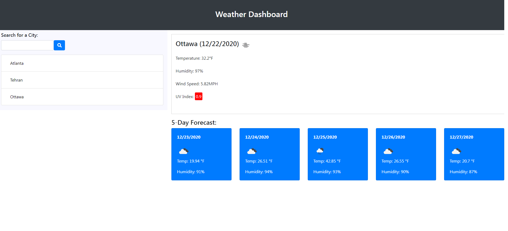

# Weather App

In this project I used the OpenWeather API to retrieve weather data for a given city entered by the user. The app has a search facility where the user provides the name of a city that they are looking for a forecast for, and the app provides the current weather data along with the 5 day future forecast for that city. The city is saved in the search history for that user via local storage. The weather data includes temperature, humidity, UV index and wind speed.

Below is a snapshot of the project.

## Instructions

After saving the app, click on index.html to view the app.

## Usage
This app gives the current and 5 day weather forecast for the provided city.
